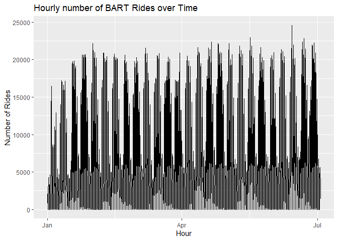
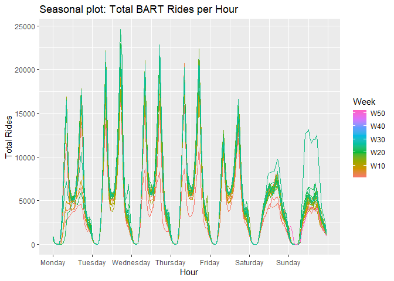
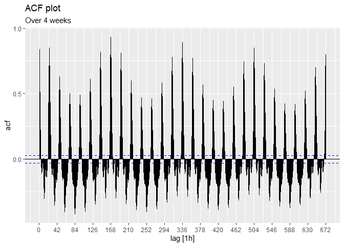

# Exploration

This document is for me to explore different aspects of the data before
creating the dashboard. `fpp3` libraries will be used to assist in
exploring the data.

``` r
library(fpp3)
```

    Warning: package 'fpp3' was built under R version 4.3.1

    ── Attaching packages ────────────────────────────────────────────── fpp3 0.5 ──

    ✔ tibble      3.2.1     ✔ tsibble     1.1.3
    ✔ dplyr       1.1.2     ✔ tsibbledata 0.4.1
    ✔ tidyr       1.3.0     ✔ feasts      0.3.1
    ✔ lubridate   1.9.2     ✔ fable       0.3.3
    ✔ ggplot2     3.4.2     ✔ fabletools  0.3.3

    Warning: package 'tsibble' was built under R version 4.3.1

    Warning: package 'tsibbledata' was built under R version 4.3.1

    Warning: package 'feasts' was built under R version 4.3.1

    Warning: package 'fabletools' was built under R version 4.3.1

    Warning: package 'fable' was built under R version 4.3.1

    ── Conflicts ───────────────────────────────────────────────── fpp3_conflicts ──
    ✖ lubridate::date()    masks base::date()
    ✖ dplyr::filter()      masks stats::filter()
    ✖ tsibble::intersect() masks base::intersect()
    ✖ tsibble::interval()  masks lubridate::interval()
    ✖ dplyr::lag()         masks stats::lag()
    ✖ tsibble::setdiff()   masks base::setdiff()
    ✖ tsibble::union()     masks base::union()

# `README`

Now BART’s data contains a `README` file. This mostly gives an overview
of the column names and how they are stored. The columns are:

``` r
col_names <- c(
  "day",
  "hour",
  "origin_station",
  "destination_station",
  "trip_count"
)
```

These are stored to help with reading the data later.

The file also mentions that the names of the different stations are
abbreviated and provides the [download link for a
spreadsheet](https://www.bart.gov/sites/default/files/docs/Station_Names.xls)
giving the corresponding full names. After downloading, I was able to
read this into a tibble.

``` r
station_tibble <- readxl::read_xls("Station_Names.xls") %>%
  rename(
    station_code = `Two-Letter Station Code`,
    station_name = `Station Name`
  )

station_tibble
```

    # A tibble: 50 × 2
       station_code station_name                     
       <chr>        <chr>                            
     1 RM           Richmond                         
     2 EN           El Cerrito Del Norte             
     3 EP           El Cerrito Plaza                 
     4 NB           North Berkeley                   
     5 BK           Berkeley                         
     6 AS           Ashby                            
     7 MA           MacArthur                        
     8 19           19th Street Oakland              
     9 12           12th Street / Oakland City Center
    10 LM           Lake Merritt                     
    # ℹ 40 more rows

The full `README` can be found
[here](http://64.111.127.166/origin-destination/READ%20ME.txt).

# Reading Data

I decided to preview the most recent data.

``` r
rides_2023 <- readr::read_csv(
  "http://64.111.127.166/origin-destination/date-hour-soo-dest-2023.csv.gz",
  col_names = col_names
)

rides_2023
```

    # A tibble: 4,279,646 × 5
       day         hour origin_station destination_station trip_count
       <date>     <dbl> <chr>          <chr>                    <dbl>
     1 2023-01-01     0 12TH           12TH                         1
     2 2023-01-01     0 12TH           16TH                         1
     3 2023-01-01     0 12TH           19TH                         2
     4 2023-01-01     0 12TH           24TH                         3
     5 2023-01-01     0 12TH           ASHB                         2
     6 2023-01-01     0 12TH           CONC                         1
     7 2023-01-01     0 12TH           DBRK                         2
     8 2023-01-01     0 12TH           DELN                         1
     9 2023-01-01     0 12TH           EMBR                         1
    10 2023-01-01     0 12TH           FTVL                         1
    # ℹ 4,279,636 more rows

Now, one issue with this data is that the station abbreviations do not
match those given in the spreadsheet.

## Matching Abbreviations

There is a webpage where the longer abbreviations are stored. These are
stored for the current abbreviations.

``` r
station_tibble <- "https://api.bart.gov/docs/overview/abbrev.aspx" %>%
  rvest::read_html() %>%
  rvest::html_table(header = TRUE) %>%
  purrr::pluck(1) %>%
  rename(
    station_code = Abbr,
    station_name = `Station Name`
  ) %>%
  mutate(station_code = toupper(station_code))

station_tibble
```

    # A tibble: 48 × 2
       station_code station_name                
       <chr>        <chr>                       
     1 12TH         12th St. Oakland City Center
     2 16TH         16th St. Mission (SF)       
     3 19TH         19th St. Oakland            
     4 24TH         24th St. Mission (SF)       
     5 ASHB         Ashby (Berkeley)            
     6 ANTC         Antioch                     
     7 BALB         Balboa Park (SF)            
     8 BAYF         Bay Fair (San Leandro)      
     9 CAST         Castro Valley               
    10 CIVC         Civic Center (SF)           
    # ℹ 38 more rows

Now this is missing two stations:

- Milpitas

- Berryessa / North San José

These are added to the tibble.

``` r
station_tibble <- rides_2023 %>%
  distinct(origin_station) %>%
  rename(station_code = origin_station) %>%
  anti_join(station_tibble, by = "station_code") %>%
  mutate(station_name = c("Berryessa / North San José", "Milpitas")) %>%
  bind_rows(station_tibble)

station_tibble
```

    # A tibble: 50 × 2
       station_code station_name                
       <chr>        <chr>                       
     1 BERY         Berryessa / North San José  
     2 MLPT         Milpitas                    
     3 12TH         12th St. Oakland City Center
     4 16TH         16th St. Mission (SF)       
     5 19TH         19th St. Oakland            
     6 24TH         24th St. Mission (SF)       
     7 ASHB         Ashby (Berkeley)            
     8 ANTC         Antioch                     
     9 BALB         Balboa Park (SF)            
    10 BAYF         Bay Fair (San Leandro)      
    # ℹ 40 more rows

These abreviations are saved in order to be read later.

``` r
saveRDS(station_tibble, "abbreviations.RDS")
```

# Rides

Now, it might be helpful to store the data into a `tsibble`. These are
similar to `tibble`s but are indexed by time.

``` r
BART_tsibble <- rides_2023 %>%
  mutate(
    hour = stringr::str_glue("{day} {hour}") %>%
      lubridate::ymd_h(tz = "US/Pacific"),
    .keep = "unused"
  ) %>%
  as_tsibble(
    index = hour,
    key = c("origin_station", "destination_station")
  ) %>%
  fill_gaps(trip_count = 0)

BARTRides <- BART_tsibble %>%
  summarize(trip_count = sum(trip_count))
```

Storing the data in a `tsibble` will allow for some more time series
plots.

``` r
BARTRides %>%
  autoplot(.vars = trip_count) +
  labs(
    title = "Hourly number of BART Rides over Time",
    x = "Hour",
    y = "Number of Rides"
  )
```



Here, some seasonal patterns are apparent. A seasonal plot may help.
Since the data is stored hourly, a weekly plot may help.

``` r
BARTRides %>%
  gg_season(y = trip_count, period = "week") +
  labs(
    title = "Seasonal plot: Total BART Rides per Hour",
    x = "Hour",
    y = "Total Rides",
    color = "Week"
  )
```



From this plot, it appears that there is a consistent pattern for
weekdays, while weekends have their own consistent pattern.

# Potential models

Since the data seems to have some seasonal aspect, models with seasonal
components will be used. Since there seems to be two distinct patterns,
a seasonal period of an entire week will be used. This season will
consist of $7 \cdot 24 = 168$ observations.

``` r
BARTRides %>%
  model(
    seasonal_naive = SNAIVE(trip_count ~ lag("week")),
    stl = STL(trip_count ~ season(168))
  ) %>%
  accuracy()
```

    # A tibble: 2 × 10
      .model         .type       ME  RMSE   MAE   MPE  MAPE  MASE RMSSE  ACF1
      <chr>          <chr>    <dbl> <dbl> <dbl> <dbl> <dbl> <dbl> <dbl> <dbl>
    1 seasonal_naive Training 87.8  1390.  628.  -Inf   Inf 0.426 0.502 0.747
    2 stl            Training  4.86  888.  478.   NaN   Inf 0.324 0.321 0.718

Overall, the STL model seems to perform better in more metrics than the
seasonal naive model.

To test the accuracy further, the 2023 data is used to test the accuracy
of an STL model fit on 2022 data.

``` r
training <- readr::read_csv(
  "http://64.111.127.166/origin-destination/date-hour-soo-dest-2022.csv.gz",
  col_names = col_names
) %>%
  mutate(
    hour = stringr::str_glue("{day} {hour}") %>%
      lubridate::ymd_h(tz = "US/Pacific"),
    .keep = "unused"
  ) %>%
  as_tsibble(
    index = hour,
    key = c("origin_station", "destination_station")
  ) %>%
  summarize(trip_count = sum(trip_count)) %>%
  fill_gaps(trip_count = 0)
```

    Rows: 8245370 Columns: 5
    ── Column specification ────────────────────────────────────────────────────────
    Delimiter: ","
    chr  (2): origin_station, destination_station
    dbl  (2): hour, trip_count
    date (1): day

    ℹ Use `spec()` to retrieve the full column specification for this data.
    ℹ Specify the column types or set `show_col_types = FALSE` to quiet this message.

Now when forecasting with an STL model, we have to forecast the
seasonally adjusted data using a seasonal naive method.

``` r
training %>%
  model(
    stl = decomposition_model(
      STL(trip_count ~ season(168)),
      SNAIVE(season_adjust)
    )
  ) %>%
  forecast(BARTRides) %>%
  accuracy(BARTRides)
```

    # A tibble: 1 × 10
      .model .type    ME  RMSE   MAE   MPE  MAPE  MASE RMSSE  ACF1
      <chr>  <chr> <dbl> <dbl> <dbl> <dbl> <dbl> <dbl> <dbl> <dbl>
    1 stl    Test  1778. 3124. 2087.   NaN   Inf   NaN   NaN 0.700

It is important to note that the STL model seems to have a lower
accuracy than the seasonally naive model. Since the seasonally naive
model is based on the most recent period, it might be good to look at
the autocorrelation to evaluate it.

## Autocorrelation evaluation

``` r
BARTRides %>%
  ACF(trip_count, lag_max = 4 * 168) %>%
  autoplot() +
  scale_x_continuous(breaks = 0:16 * 7 * 6) +
  labs(
    title = "ACF plot",
    subtitle = "Over 4 weeks"
  )
```



From the ACF plot, it appears that the autocorrelation peaks at lags
that are multiples of 168. Since this corresponds to weekly periods, it
appears that the seasonally naive model may be fairly accurate in this
case.

## Best model

Since ridership seems to have extremely high autocorrelation using
weekly lags, a seasonally naive model with a weekly period appears to be
the most appropriate.
