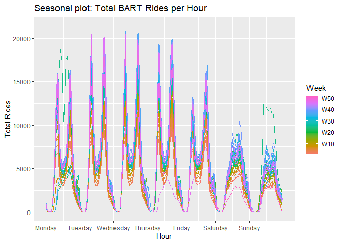

Exploration
================

This document is for me to explore different aspects of the data before
creating the dashboard. `tidyverse` libraries will be used to assist in
exploring the data.

``` r
library(tidyverse)
library(tsibble)
library(fable)
library(feasts)
```

# `README`

Now BART’s data contains a `README` file. This mostly gives an overview
of the column names and how they are stored. The columns are:

``` r
col_names <- c(
  "day",
  "hour",
  "origin_station",
  "destination_station",
  "trip_count"
)
```

These are stored to help with reading the data later.

The file also mentions that the names of the different stations are
abbreviated and provides the [download link for a
spreadsheet](https://www.bart.gov/sites/default/files/docs/Station_Names.xls)
giving the corresponding full names. After downloading, I was able to
read this into a tibble.

``` r
station_tibble <- readxl::read_xls("Station_Names.xls") %>%
  rename(
    station_code = `Two-Letter Station Code`,
    station_name = `Station Name`
  )

station_tibble
```

    # A tibble: 50 × 2
       station_code station_name                     
       <chr>        <chr>                            
     1 RM           Richmond                         
     2 EN           El Cerrito Del Norte             
     3 EP           El Cerrito Plaza                 
     4 NB           North Berkeley                   
     5 BK           Berkeley                         
     6 AS           Ashby                            
     7 MA           MacArthur                        
     8 19           19th Street Oakland              
     9 12           12th Street / Oakland City Center
    10 LM           Lake Merritt                     
    # … with 40 more rows

The full `README` can be found
[here](http://64.111.127.166/origin-destination/READ%20ME.txt).

# Reading Data

I decided to preview the most recent data.

``` r
rides_2022 <- read_csv(
  "http://64.111.127.166/origin-destination/date-hour-soo-dest-2022.csv.gz",
  col_names = col_names
)

head(rides_2022)
```

    # A tibble: 6 × 5
      day         hour origin_station destination_station trip_count
      <date>     <dbl> <chr>          <chr>                    <dbl>
    1 2022-01-01     0 12TH           12TH                         1
    2 2022-01-01     0 12TH           16TH                         1
    3 2022-01-01     0 12TH           24TH                         2
    4 2022-01-01     0 12TH           ASHB                         1
    5 2022-01-01     0 12TH           MONT                         1
    6 2022-01-01     0 12TH           POWL                         2

Now, one issue with this data is that the station abbreviations do not
match those given in the spreadsheet.

## Matching Abbreviations

There is a webpage where the longer abbreviations are stored. These are
stored for the current abbreviations.

``` r
station_tibble <- "https://api.bart.gov/docs/overview/abbrev.aspx" %>%
  rvest::read_html() %>%
  rvest::html_table(header = TRUE) %>%
  pluck(1) %>%
  rename(
    station_code = Abbr,
    station_name = `Station Name`
  ) %>%
  mutate(station_code = toupper(station_code))

station_tibble
```

    # A tibble: 48 × 2
       station_code station_name                
       <chr>        <chr>                       
     1 12TH         12th St. Oakland City Center
     2 16TH         16th St. Mission (SF)       
     3 19TH         19th St. Oakland            
     4 24TH         24th St. Mission (SF)       
     5 ASHB         Ashby (Berkeley)            
     6 ANTC         Antioch                     
     7 BALB         Balboa Park (SF)            
     8 BAYF         Bay Fair (San Leandro)      
     9 CAST         Castro Valley               
    10 CIVC         Civic Center (SF)           
    # … with 38 more rows

Now this is missing two stations:

-   Milpitas

-   Berryessa / North San José

These are added to the tibble.

``` r
station_tibble <- rides_2022 %>%
  distinct(origin_station) %>%
  rename(station_code = origin_station) %>%
  anti_join(station_tibble, by = "station_code") %>%
  mutate(station_name = c("Milpitas", "Berryessa / North San José")) %>%
  bind_rows(station_tibble)
```

# Rides

Now, it might be helpful to store the data into a `tsibble`. These are
similar to `tibble`s but are indexed by time.

``` r
BART_tsibble <- rides_2022 %>%
  mutate(
    hour = str_glue("{day} {hour}") %>%
      lubridate::ymd_h(tz = "US/Pacific"),
    .keep = "unused"
  ) %>%
  as_tsibble(
    index = hour,
    key = c(origin_station, destination_station)
  ) %>%
  fill_gaps(trip_count = 0)
```

Storing the data in a `tsibble` will allow for some more time series
plots.

``` r
BART_tsibble %>%
  summarize(trip_count = sum(trip_count)) %>%
  autoplot(.vars = trip_count) +
  labs(
    title = "Hourly number of BART Rides over Time",
    x = "Hour",
    y = "Number of Rides"
  )
```


Here, some seasonal patterns are apparent. A seasonal plot may help.
Since the data is stored hourly, a weekly plot may help.

``` r
BART_tsibble %>%
  summarize(trip_count = sum(trip_count)) %>%
  gg_season(y = trip_count, period = "week") +
  labs(
    title = "Seasonal plot: Total BART Rides per Hour",
    x = "Hour",
    y = "Total Rides",
    color = "Week"
  )
```



From this plot, it appears that there is a consistent pattern for
weekdays, while weekends have their own consistent pattern.
